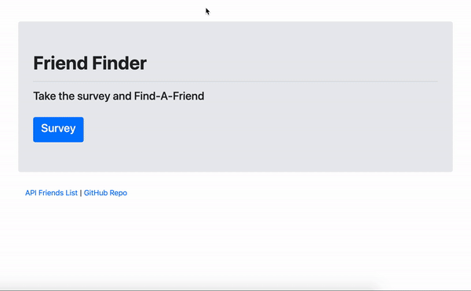

# Friend Finder - Node, Express, MySQL

### Overview

a compatibility-based "FriendFinder" application -- basically a dating app. This full-stack site takes in results from your users' surveys, then compare their answers with those from other users. The app will then display the name and picture of the user with the best overall match. This app uses Express to handle routing.

### Goal for the app

1.  Survey should have 10 questions of your choosing. Each answer should be on a scale of 1 to 5 based on how much the user agrees or disagrees with a question.

2.  `server.js` file should require the basic npm packages: `express`, `path`, `mysql`

3.  Public folder should include two files - it should also be static in your server.js file

    - A GET Route to `survey.html` which should display the survey page.

      this page should

      show a form
      input with user's name - this will go into the friend table as the friend_name

           input with the picture - this will go into the friends table

           of all of the questions and a dropdown or radio buttons of 1 to 5
             the results of this will go into the scores table

    - home page `index.html`

      should link to survey.html and display all the friends in the database

4.  `server.js` file should contain two routes:

    - A GET route with the url `/api/friends`. This will be used to display all friends from the friends table in json

    - A POST routes `/api/friends`. This will be used to handle incoming survey results. This route will also be used to handle the compatibility logic.

5.  You should save your application's data inside of `app/db/schema.sql and seeds.sql`

in the schema.sql file:

your questions table should have all of the questions
id, question

your friends table should have a name and photo column
id, name, picture_link

your scores table should have
id, question_id, friend_id, score

in the seeds.sql file:

write some inserts into the questions table

6. Determine the user's most compatible friend using the following as a guide:

compare the differences between the person's score and other people's scores, the smallest differences are possible friendships

remember to take the absolute value

7. Once the current user's most compatible friend is found , display the result(s) on the page

it should show the name of the friend and the picture
